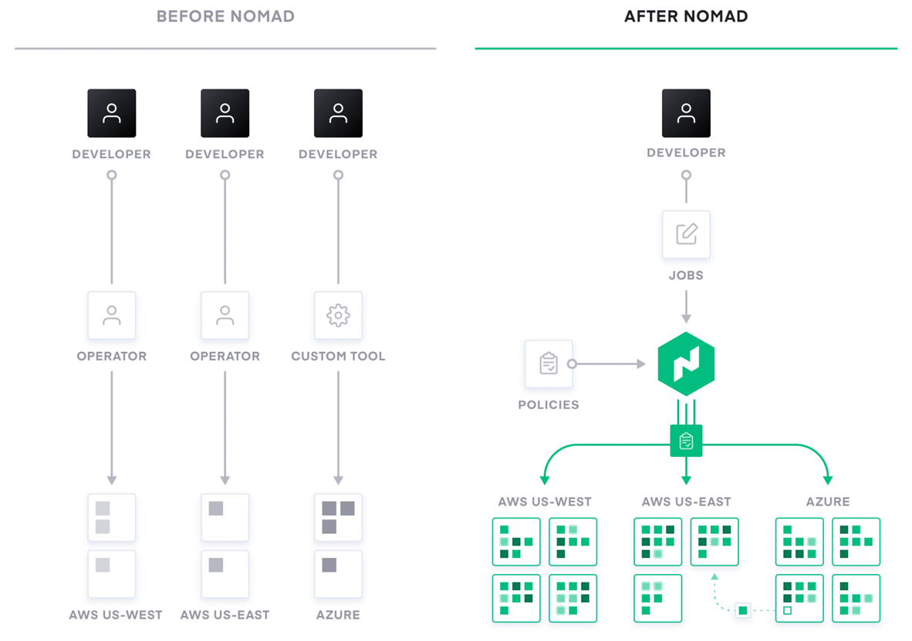
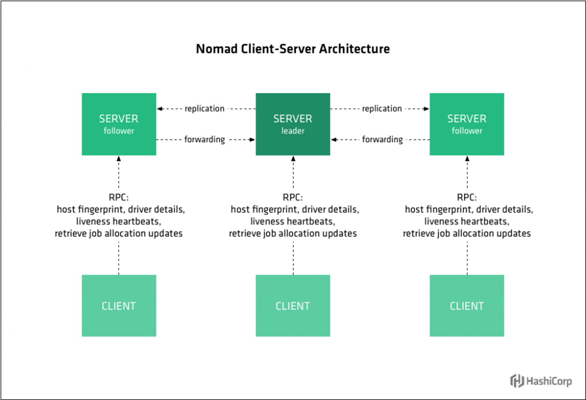

## nomad介绍
Nomad是一个管理机器集群并在集群上运行应用程序的工具。
Nomad的特点：
支持docker,Nomad的job可以使用docker驱动将应用部署到集群中。
Nomad安装在linux中仅需单一的二进制文件，不需要其他服务协调，Nomad将资源管理器和调度程序的功能集成到一个系统中。
多数据中心，可以跨数据中心调度。
分布式高可用，支持多种驱动程序（Docker、VMS、Exec、Java）运行job，支持多种系统（Linux、Windows、BSD、OSX）。


## nomad中的几个重要概念

server，可以看作是nomad的管理节点，一群server可以互相通信，形成一个高可用的dc，进而组成region。
client，通过通信协议注册到server，并受server控制和调度的主机，job在其上运行
job，在nomad client上运行的业务
task，在client上执行的任务，一个或多个task组成job
## nomad的安装和启动
[官网](https://www.nomadproject.io/downloads)上根据操作系统和CPU，选择合适版本下载，解压后得到可执行文件，放到一个合适的地方，就安装完啦。

启动也很简单，命令行输入：nomad agent -config 配置文件名

根据配置文件，nomad启动为server/client，或者两者皆有


另外，nomad由go语言编写，源代码在[github](https://github.com/hashicorp/nomad)

## Nomad的配置文件
nomad的配置文件可以写成server和client分开的，也可以写成一起的，下面给出一个例子：
```
#bind_addr = "10.1.41.221"

datacenter = "FT2000"
data_dir = "/opt/nomad"
disable_update_check = true

limits {
  log_rotate_bytes = 1024000000
  log_rotate_max_files = 7
}

name = "node1"
region = "smsx"
```
通用配置，server和client都需要，#开始为注释
data_dir设置了nomad的数据路径，server会存放节点信息，而client会存放运行job时候的文件
除了data_dir，其他都是可选的，不设置也有默认值，但如果设置了datacenter，那server和client需要对应，否则无法注册

```
server {
  enabled = true
  bootstrap_expect = 1

#  server_join {
#    retry_join = ["10.1.41.225:4648"]
#    retry_join = ["10.1.41.225:4648", "10.1.41.20:4648"]
#  }
}
```
bootstrap_expect设置需要几个server节点才能正常工作，生产环境一般是3，我们自己随便用用1个就可以了

server_join设置本server自动加入哪些server节点，注意一下端口为4648，这里我们单机用用就直接注释了

```

client {
  enabled = true
  servers = ["10.1.41.225:4647"]
#  network_interface = "enp9s0f2"
  host_volume "mysql" {
    path = "/opt/docker/mysql"
    read_only = false
  }
  host_volume "storage" {
    path = "/opt/docker/storage"
    read_only = false
  }
}
```
servers设置client注册到哪个server，注意端口是4647，和server-server的不一样
host_volume设置了将主机存储虚拟到一个卷，用于数据持久化等

```
plugin "docker" {
  config {
    volumes {
      enabled      = true
      selinuxlabel = "z"
    }
  }
}
```
设置plugin的一些参数，这里是配置了docker的volumes可以直接由主机映射到docker，不经过过nomad，不然docker的-v参数映射的目录都是基于nomad的文件系统路径。

还有更多的配置，参见[官网文档](https://www.nomadproject.io/docs/configuration)

## Job描述文件
Nomad将client上需要运行的业务称为job，一个job的配置文件里面可以有多个任务。
Job、group、task是层级关系，描述文件里也保持这样的结构
```
job
   \_ group
           \_ task
```
简单讲一下job的编写，详细的文档等还是见[官网](https://www.nomadproject.io/docs/job-specification)
```
job "bvc" {
  datacenters = ["FT2000"]

  type = "service"

  group "bvc25" {
    count = 1

    network {
      port "mysql" {
        static = 3307
        to = 3306
      }
    }

    volume "db" {
      type      = "host"
      source    = "mysql"
      read_only = false
    }

    volume "hd" {
      type      = "host"
      source    = "storage"
      read_only = false
    }
```
datacenters是必选项，和client的设置要对应

如果需要做端口映射，则需要在network中定义，给端口起名，static为主机的端口，to为task实际的端口。
如果是主机模式，则需要在network里设置mode：
network {      mode = "host"    }

volume将之前我们在client节点配置中定义的卷挂载到job中，后续可以再分别挂载到各个task

```

    task "mysql" {
      driver = "docker"

      resources {
          cpu    = 1500
          memory = 1024
        }

      artifact {
          source = "http://10.1.41.225/mysql-bvc25.tar"
        }

        # Configuration is specific to each driver.
      config {
          load = "mysql-bvc25.tar"
          image = "mysql-bvc-25:1.0"
          ports = ["mysql"]

          volumes = [
             "/opt/docker/storage/mysql.conf.d:/etc/mysql/mysql.conf.d"
          ]

      }

      env {
      		MYSQL_ROOT_PASSWORD = "123456"
          MYSQL_USER = "sumadb"
          MYSQL_PASSWORD = "Sumavision@300079"
      }

      volume_mount {
          volume      = "db"
          destination = "/var/lib/mysql"
      }

      volume_mount {
          volume      = "hd"
          destination = "/home/docker"
      }
    }
  }
}
```
nomad支持好几种driver，我们这里用的是docker，还有进程、java等好几种；各个driver支持的设置项可能会有所不同，这里说的设置项都是适用于docker的。

artifact指明了docker镜像的下载地址，支持http/https，job启动后，nomad会自动下载到刚才client配置的data目录下的各个task目录

load指明镜像的文件名，如果没有artifact，nomad会自动去task目录下找
image指明镜像的tag，如果没有load，nomad会通过dockerhub去下载
ports是前面在network中命名的端口

volume_mount将client定义的卷直接挂载到docker下

下面再给一个task运行docker的完整job例子，更多docker参数，及更多支持的驱动见[官网](https://www.nomadproject.io/docs/drivers)
```
job "tetris" {
  datacenters = ["FT2000"]
  type = "service"

  group "bvc" {
    # Specify the number of these tasks we want.
    count = 1

    network {
      mode = "host"
    }

    volume "hd" {
      type      = "host"
      source    = "storage"
      read_only = false
    }

    task "bvc25" {
      driver = "docker"

      resources {
          cpu    = 24000
          memory = 13000
        }

      artifact {
          source = "http://10.1.41.225/bvc25-1.2.tar"
        }

      config {
          load = "bvc25-1.2.tar"
          image = "bcv25:1.2"
          network_mode = "host"
          volumes = [
             # Use absolute paths to mount arbitrary paths on the host
             "/opt/docker/storage/log:/var/log",
             "/opt/docker/storage/log:/usr/sbin/sumavision/log",
             "/opt/docker/storage/logs:/usr/sbin/sumavision/logs",
             "/opt/docker/storage/logs:/var/logs",
          ]

      }

      volume_mount {
          volume      = "hd"
          destination = "/home/docker"
      }
    }
  }
}

```
resources设置了给task分配的资源，要注意同一个client node上，各个task的资源之和不能超过总量，否则task会起不来报错

network_mode = “host”表明这个docker用的是主机模式，等价于docker命令行的—network host设置项

volumes等价于docker命令行的-v设置项，将主机目录映射给docker。特殊一点是nomad会处理相对路径，设置为task的自有存储路径：
“/opt/docker/storage/log:/var/log”，是主机目录
“opt/docker/storage/log:/var/log”，则是task存储下的“opt/docker/storage/log”目录

## 二次开发
nomad提供了RESTful HTTP API，可以较为方便的集成到我们现有系统，我们自己实现UI部分，完善资源管控等方面。
详细的API见[官网文档](https://www.nomadproject.io/api-docs)