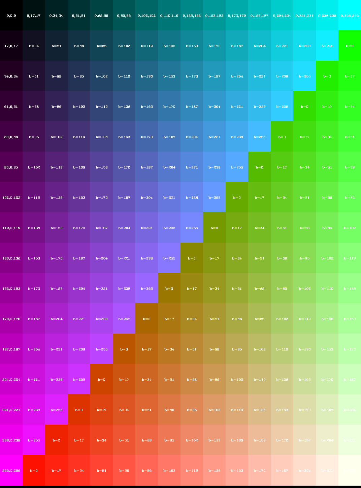
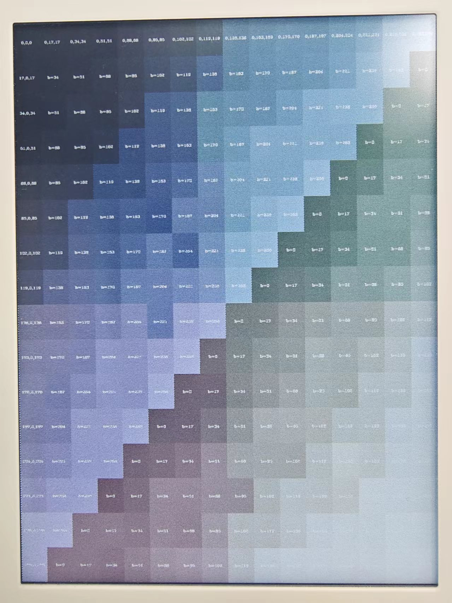

想用彩色墨水屏做个电子相框，本来都看好了微雪的屏，逛淘宝时偶然发现了一款彩色墨水屏的电子书，翰林阅reader6 color，号称是4096色，还是安卓系统，那不比微雪的7色屏+ESP单片机可玩性强多了，果断剁手。
但是买回来就发现，彩色显示差强人意吧，测试了一下渐变色块，似乎在（R，G，B）>200的情况下，没有区分度了。

那就取[0，64，128，192，255]作为RGB的取值范围，对图像做个抖动处理。