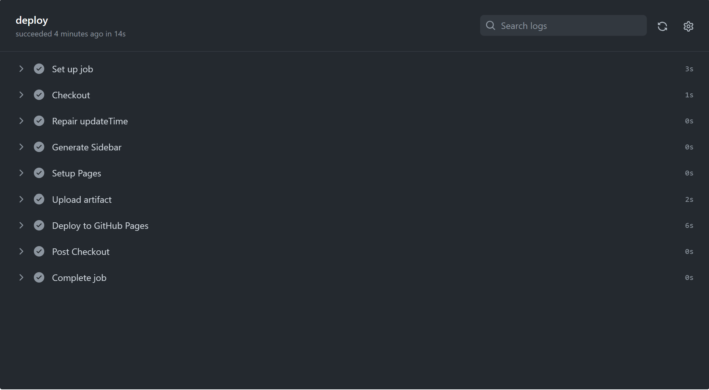

折腾了半天，放弃提交到master，触发action生成sidebar再提交到gh-pages，然后从gh-pages再用github的内置action发布的方式，直接自己用action实现发布。
```
jobs:
  deploy:
    runs-on: ubuntu-latest
    steps:
    - name: Checkout
      uses: actions/checkout@v3
      with:
        fetch-depth: '0'
    - name: Repair updateTime
      run:  |
            git config --global core.quotepath false
            git ls-files | while read file; do touch -d $(git log -1 --format="@%ct" "$file") "$file"; done
    - name: Generate Sidebar
      run: find . -mindepth 2 -name "*.md" | awk -F'/' 'BEGIN {RS="\\.md"} {arr[$2]=arr[$2]"\n    - ["$3"](/"$2"/"$3")"} END { num = asorti(arr, indices); for (i=1; i<=num; ++i) if (indices[i]) print "- "indices[i], arr[indices[i]]}' > _sidebar.md
    - name: Setup Pages
      uses: actions/configure-pages@v3
    - name: Upload artifact
      uses: actions/upload-pages-artifact@v1
      with:
        # Upload entire repository
        path: '.'
    - name: Deploy to GitHub Pages
      id: deployment
      uses: actions/deploy-pages@v2
```

一次性完事。

