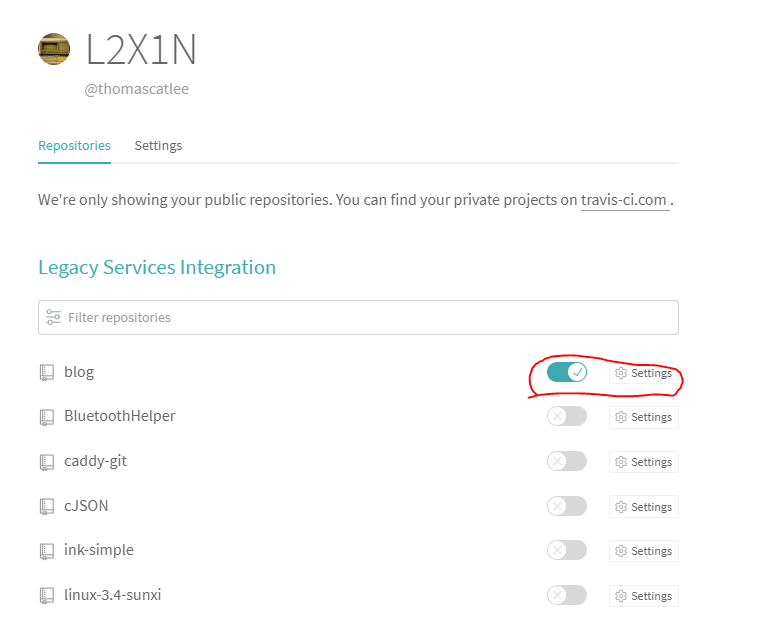
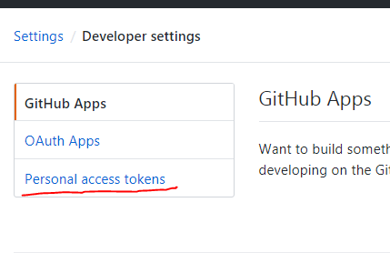

# 迁移到github
之前的服务器似乎被墙了，70周年也懒得折腾，打算过去再说。偶然发现docsify，现在的人真是聪明，用js在浏览器完成了原来静态blog工具做的md到html的工作。这样github就可以作为blog主机来使用。
github上新开一个repo，然后参考[Wsine的blog](https://github.com/Wsine/blog)，原样复制了index.html和.travis.yml，没有用docsify的init。这样直接有了支持目录结构的侧边栏等等。docsify还有不少插件，等有空再研究。

为了实现提交md文件后自动更新侧边栏，需要用ci来实现。关联github和travis-ci（这里要注意用.org而不是.com，后者是收费的）。

这里要注意，github里生成token，然后travis-ci里面设置一下GITHUB_TOKEN

[新的猫窝](https://thomascatlee.github.io/blog/#/)就完成了。只是md还有一些原来ink的格式头，现在直接显示出来了。暂时先这样吧。

写一篇记录一下，毕竟懒癌晚期的我又有一年没有更新了。